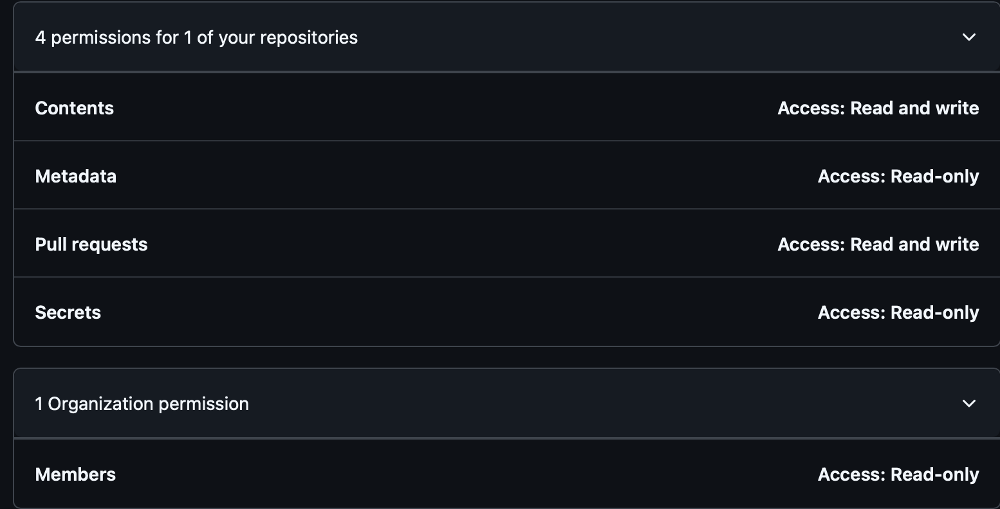

# Purpose

This custom GitHub Action was created to integrate Loco Translations into your CI/CD pipeline. It allows you to download translations from `https://localise.biz` and create/update PR with translated files.

# Github Action: Loco Translations `flipdishbytes/loco-translations@v1.0`

To use this Datadog CI action, add it to your pipeline workflow YAML file. Here are examples of adding traces to the pipeline depending on your needs.

### How it works?

1. Checks if there is a Pull Request opened with the `[LANG] Loco updates` title in the beginning.
    1. If there is any, it gets the latest one and reads base and target branches for this PR to reuse them.
    2. If there is no PR opened, it will generate a branch name based on the current date `loco_updates_{YYYY_MM_DD}` and will create a PR in the end.
2. Downloads translations from Loco based on the `langs` array and `format`. Set the `LOCOEXPORTKEY` secret in your GitHub Actions.
3. Applies downloaded translation files (overwrite) to the `translationsFolder` folder.
4. Checks if there are any changes based on `git status` and pushes them to the translations branch from step 1.
5. Creates a PR if there is none yet.

### How to use?

❗ Make sure you enabled `Automatically delete head branches ` in yout GitHub repository so after pull requests are merged, you can have head branches deleted automatically.

```yaml
name: GH Action workflow to download and apply Loco Translations

on:
  # allow to run manually
  workflow_dispatch:
  # run on schedule every 3 hours at 0 minutes
  schedule:
    - cron: "0 */3 * * *"

permissions: 
  id-token: write
  contents: write # must be set
  pull-requests: write # must be set


jobs:
  deploy:
    runs-on: ubuntu-latest

    steps:
      - name: Translations Loco
        uses: flipdishbytes/loco-translations@v1.0
        with:
          locoExportKey: ${{ secrets.LOCOEXPORTKEY }} # https://localise.biz -> Project -> Developer tools -> Export key from your Loco project. Set LOCOEXPORTKEY secret in your GitHub Actions.
          #mainBranch: main # it's main by default. Set it to your repository default branch if it's needed. Not required.
          langs: 'en,bg,de,es,fr,it,nl,pl,pt,fi' #language tags should match Loco languages from the project
          format: 'resx'
          # supported formats: 
          #     resx (for .NET projects),
          #     json (for Android and other ptojects using json language files),
          #     lproj (for iOS projects).
          translationsFolder: 'src/DotNET.Translations' #the folder where yout translation files are located.
          GH_TOKEN: ${{ github.token }} # leave it like that of you don't need to assign PR to teams for review.
          #GH_TOKEN: ${{ secrets.GH_TOKEN }} # use this if you need to assign PR to teams.
          #reviewer: 'flipdishbytes/delivery-enablement-team' # You have to set GH_TOKEN to your PAT if you want to add teams as revievers. Use comma if you need more than one team.
```

### GitHub Actions PAT for assigning PRs to teams.
❗ Required only to assign PRs review to teams. GitHub actions internal PAT doesn't have access to read groups. No need to do this if you are not going to assign your PRs to teams.
1. Go to `https://github.com/settings/personal-access-tokens`
2. Create Fine-grained token based on the example

3. Add `GH_TOKEN` secret to your GitHub Actions repo.
